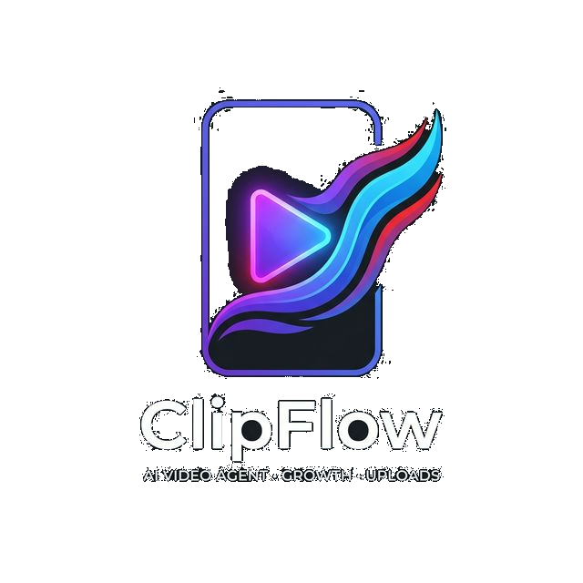

# ClipFlow

<p align="center">
  
</p>

Autonomous YouTube Shorts growth agent for [OpenClaw](https://openclaw.ai).

Competitor research. Viral ideas with scores. Scripts in your voice.
Canva drafts. Optimal timing. Auto-upload. Performance tracking.
Gets smarter every video. Runs 24/7.

---

## What ClipFlow Does vs What You Do

| ClipFlow handles | You handle |
|---|---|
| Weekly competitor scan (automatic) | Film the Short (~60 seconds) |
| Generate ranked viral ideas | Approve idea ("yes / no / tweak") |
| Write full script + SEO package | Review script (optional edits) |
| Build 9:16 Canva draft + thumbnail | Export from Canva, add footage, render |
| Recommend 3 publish slots with reasoning | Pick a slot ("slot 1" or "Friday 10am") |
| Upload video with all metadata | Send the rendered file |
| Schedule publish time | — |
| 48h / 7d / 30d performance tracking | Share stats when ClipFlow asks |
| Build timing model over time | — |

---

## Requirements

- [OpenClaw](https://openclaw.ai) — any LLM (Claude, GPT, Qwen3.5, Ollama)
- YouTube Data API v3 key — free, from Google Cloud Console
- YouTube Analytics API — same Google Cloud project
- [Postiz](https://postiz.com) account — for video upload (free tier works)
- Canva account — optional, for System 4 Canva drafts

**Model note:** ClipFlow works with any LLM. The Canva draft system
requires tool calling — ClipFlow tests this at runtime and falls back
to a detailed visual brief automatically if unavailable. All other
systems work on any model including small local Ollama models.

---

## Install

```bash
git clone https://github.com/[yourrepo]/clipflow-agent ~/clipflow-agent
bash ~/clipflow-agent/setup.sh
```

Then verify your API connection:

```bash
node ~/clipflow-agent/scripts/clipflow-setup.js
```

Then merge `openclaw.yaml` into your OpenClaw config and restart:

```bash
openclaw gateway restart
```

Then message your bot: **"Set up ClipFlow"**

---

## Onboarding

First run, ClipFlow asks 10 questions one at a time:

1. Name and channel name
2. Channel URL
3. Niche in one sentence
4. Target audience
5. Subscriber goal + deadline
6. Current subscriber count
7. Your voice — how do you naturally talk in videos?
8. 5–10 competitor channels to monitor
9. What to avoid — flops, off-brand formats
10. Top 2–3 video URLs (optional — for voice calibration)

Answers are written to `USER.md`. Never asked again.

---

## Usage

After setup, talk to ClipFlow naturally on Telegram, WhatsApp, or Slack:

```
Scan my competitors for what's working this week
Generate Short ideas from the latest scan
Write a script for [approved idea]
Build the Canva draft for this script
When should I post this?
Upload my Short  [attach file]
My last video got 6,400 views — log the performance
What patterns have you noticed?
```

ClipFlow also runs autonomously:
- **Daily 07:00** — morning brief, 48h performance check
- **Monday 08:00** — weekly competitor scan
- **Friday 09:00** — idea queue check

---

## Timing Intelligence by Channel Phase

**New channel (no own data)**
Uses competitor `publishedAt` timestamps to find when outlier Shorts
dropped in your niche. Recommendations labeled "competitor-derived."

**Growing channel (4–8 Shorts)**
Adds your own 48h view velocity per slot. Confidence rises.
YouTube Analytics heatmap starts populating.

**Established channel (12+ Shorts)**
Full channel-specific timing model. Competitor data becomes secondary.
High confidence recommendations from your own data.

---

## File Structure

```
clipflow-agent/
├── SOUL.md                    ← Agent identity + rules
├── USER.md                    ← Creator profile (written during onboarding)
├── AGENTS.md                  ← System routing table + onboarding
├── HEARTBEAT.md               ← Autonomous schedule
├── MEMORY.md                  ← Long-term session memory
├── SKILL.md                   ← Trigger + routing pointer (lean)
├── openclaw.yaml              ← Config snippet to merge
├── setup.sh                   ← Install script
├── scripts/
│   └── clipflow-setup.js      ← API test + channel ID resolver
├── memory/
│   ├── approved-ideas.md
│   ├── rejected-ideas.md
│   ├── performance-log.md
│   ├── competitor-scans.md
│   ├── timing-model.md
│   ├── voice-examples.md
│   └── canva-designs.md
└── references/
    ├── youtube-api.md         ← API queries + quota guide
    └── systems/
        ├── scan.md            ← System 1: Competitor scan
        ├── ideas.md           ← System 2: Idea engine
        ├── script.md          ← System 3: Script writer
        ├── canva.md           ← System 4: Canva draft
        ├── schedule.md        ← System 5: Schedule recommendation
        ├── upload.md          ← System 6: Auto upload
        ├── performance.md     ← System 7: Performance logging
        └── learning.md        ← System 8: Learning summary
```

`USER.md` and all `memory/` files are gitignored. Your data stays on your machine.

---

## Privacy

ClipFlow is local-first. Your channel data, API keys, video files,
and performance history never leave your machine unless you explicitly
configure a cloud provider.

---

## License

MIT — free to use, modify, and share.
